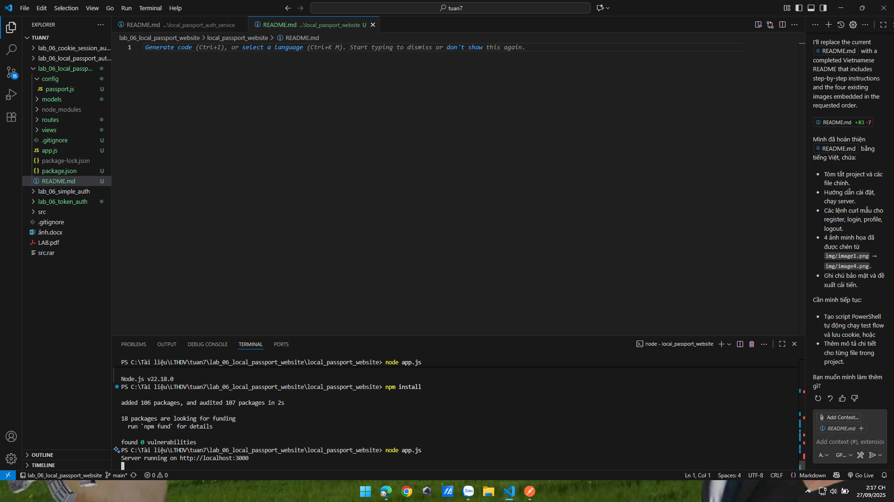
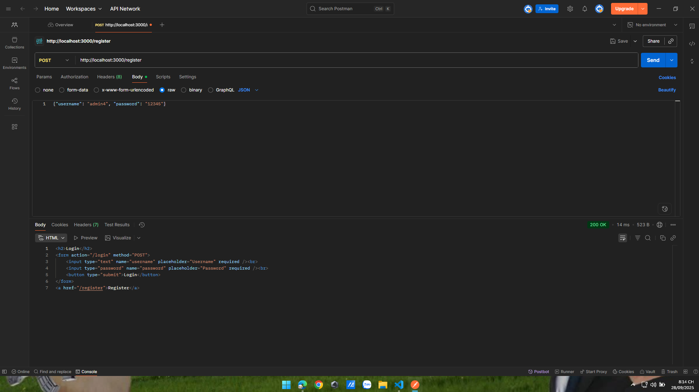
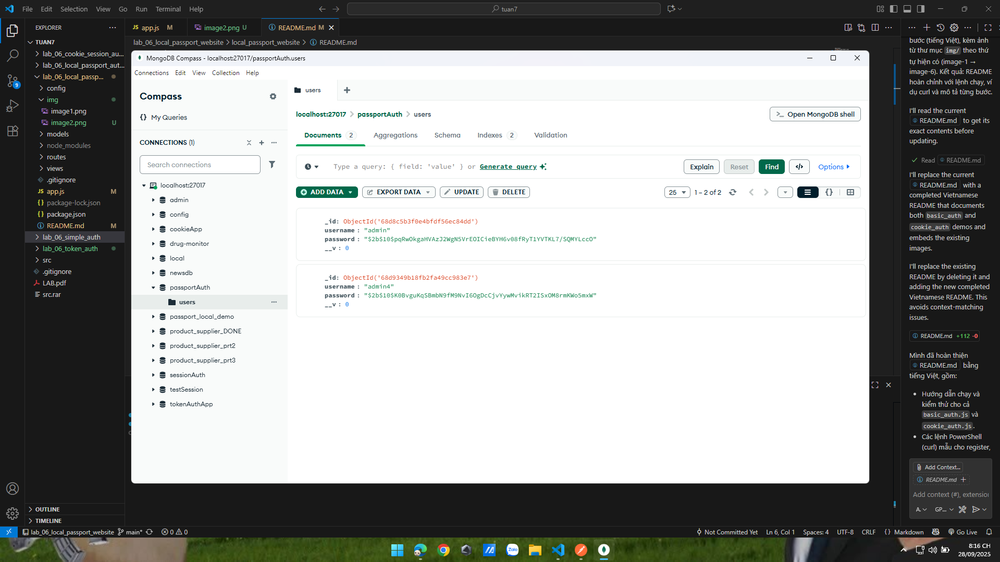
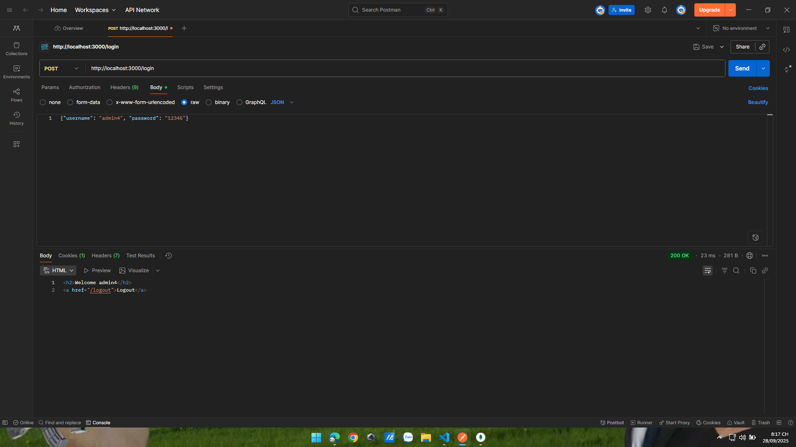

# lab_06_local_passport_website

Hướng dẫn chi tiết để chạy và kiểm thử project `local_passport_website` — một ví dụ Passport local strategy kết hợp giao diện EJS (login/register/profile).

Các file chính:

- `app.js` — cấu hình Express, session, Passport, routes và views
- `config/passport.js` — thiết lập chiến lược `passport-local`
- `routes/auth.js` — register, login, profile, logout
- `models/User.js` — Mongoose model (hash password bằng bcryptjs)
- `views/` — các view EJS (`login.ejs`, `register.ejs`, `profile.ejs`)
- `img/` — ảnh minh họa các bước test (image1.png → image4.png)

---

## Yêu cầu

- Node.js (>=16), npm
- MongoDB chạy cục bộ tại `mongodb://127.0.0.1:27017` (mặc định DB: `passport_local_demo`)

## Cài đặt & chạy

1. Mở PowerShell và chuyển vào thư mục `local_passport_website`:

```powershell
cd lab_06_local_passport_website/local_passport_website
npm install
```

2. Chạy server:

```powershell
node app.js
```

Bạn sẽ thấy log `MongoDB connected` và `Server running on http://localhost:3000`.

Ảnh minh họa server đã khởi động:



---

## Kiểm thử giao diện (website)

Ứng dụng có sẵn các trang EJS: `/login`, `/register`, `/profile`.

### Bước 2 — Register (GUI)

1. Mở trình duyệt và vào `http://localhost:3000/register`.
2. Nhập username và password rồi submit để tạo user.

Ảnh minh họa màn hình form register và kết quả submit:



### Bước 3 — Kiểm tra database (tùy chọn)

Mở MongoDB hoặc dùng một client để xác nhận user đã được lưu. Ảnh minh họa show collection/user trong MongoDB:



### Bước 4 — Login (GUI)

1. Vào `http://localhost:3000/login`.
2. Nhập credentials đã đăng ký và submit. Nếu thành công, bạn sẽ được chuyển tới trang `/profile`.

Ảnh minh họa login thành công và trang profile:



---

## API endpoints (tóm tắt)

- GET `/login` — form login
- GET `/register` — form register
- POST `/auth/register` — xử lý đăng ký (form hoặc JSON)
- POST `/auth/login` — xử lý login (Passport local)
- GET `/auth/profile` — profile bảo vệ (chỉ truy cập khi đã auth)
- GET `/auth/logout` — logout

## Ghi chú

- Mật khẩu được hash bằng `bcryptjs`.
- Session được lưu trong bộ nhớ mặc định; cho production, hãy cấu hình store (ví dụ `connect-mongo`).
- Các cấu hình (MongoDB URI, session secret) đang hard-coded; nên chuyển sang biến môi trường với `dotenv`.


